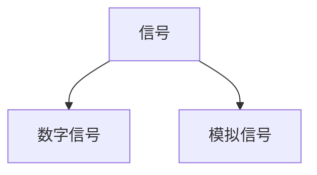
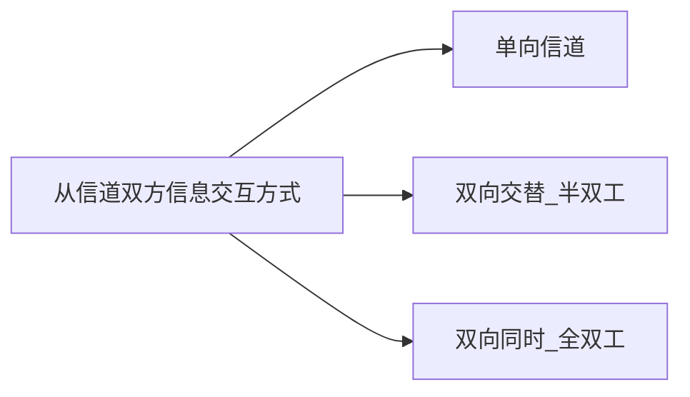
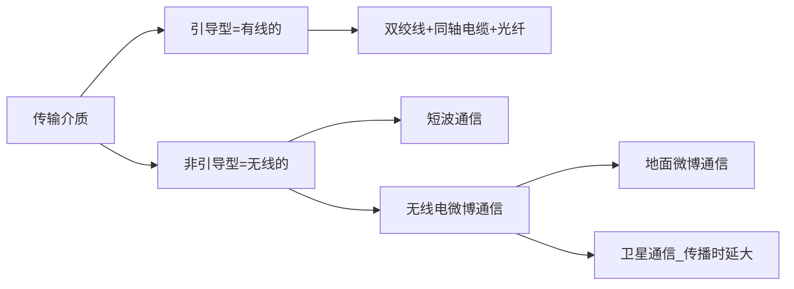

# 物理层

[toc]

## 数据通信模型




+ 两个信号都是电流，表现为电压高低不一样

  + 数字信号（离散信号），电流是突变的，一下子1一下子-1

  + 模拟信号（连续信号），电流是柔和变化的

    

## 信道



+ 单向只要一条信道，半双工和全双工要两条信道（一条来一条去）

### 调制

```mermaid
graph LR
调制-->基带调制=编码
调制-->带通调制
```

+ 基带调制：数字信号->数字信号

+ 带通调制：用载波，把基带信号频率范围提升到高频段，且转化为**模拟信号**。调完的叫**带通信号**。

####    常用编码

1. 曼彻斯特

2. 不归零

3. 归零

4. 差分曼彻斯特

### 信道极限容量

   1. 奈氏准则

   2. 香农公式

      信噪比(dB)=10log10（S/N)

## 物理层下的传输介质




## 信道复用技术

```mermaid
graph LR
信道复用-->频分复用FDM-->波分复用=光的频分复用
信道复用-->时分复用TDM
信道复用-->统计时分复用=异步时分复用
信道复用-->码分复用CDM
```


   

  

