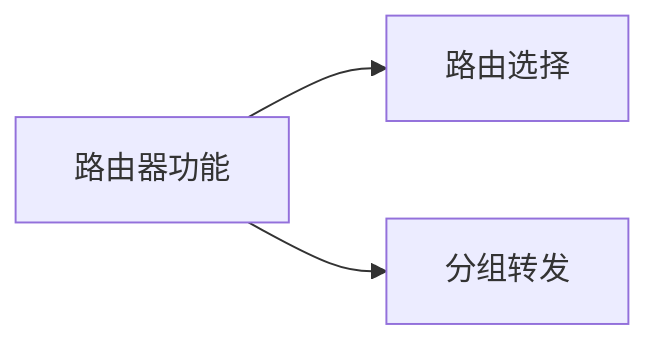
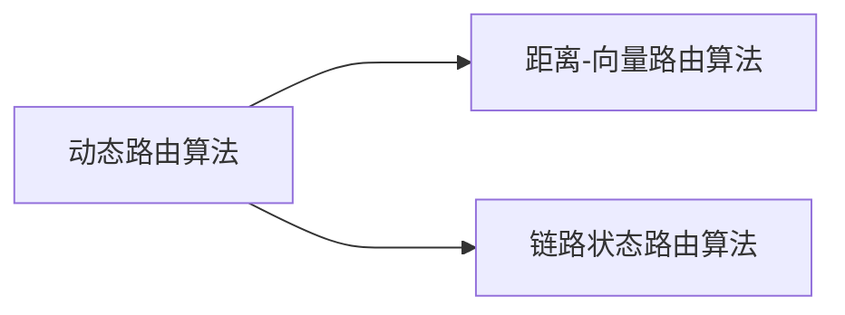
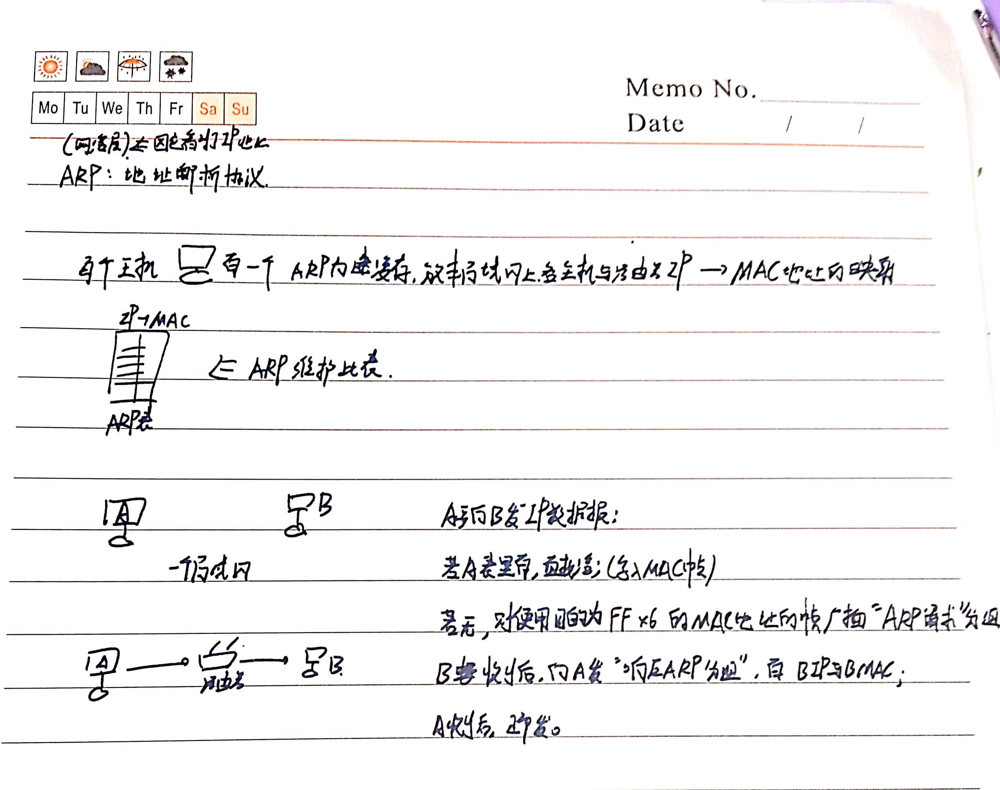
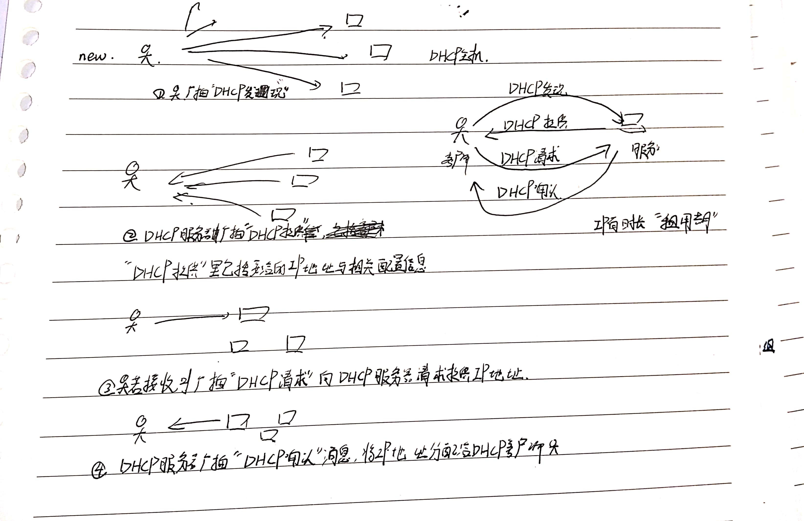
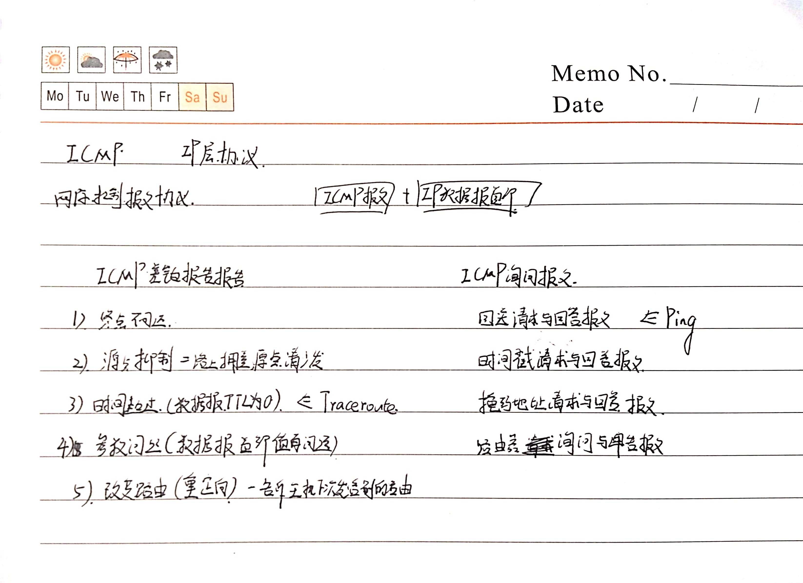
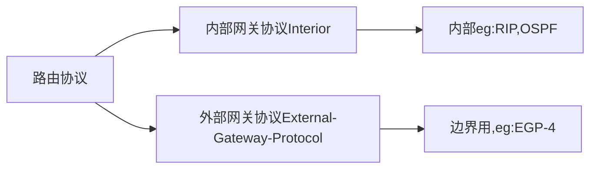

# 网络层

[toc]

**网络层功能：向上提供，无连接的，尽最大努力交付的数据报服务**

## 中继系统

+ 网络层以上：网关
+ 网络层：路由器
+ 数据链路层：网桥，交换机
+ 物理层：中继器，集线器



+ 路由选择：定期更新路径，动态改变所选择的路由
+ 分组转发：左手转右手

## 拥塞控制

网络上分组太多，堵了，大量超时重传，效率急剧下降；

可以用网络负载和吞吐量判断是否有阻塞现象发生；

```mermaid
graph LR
拥塞控制方法-->开环控制=静态,提前设计调度策略
拥塞控制方法-->闭环控制=动态,检测网络状态,适时调整
```

## 路由算法

### 静态路由（非自适应路由算法）

人手配置的，死的，适用于简单小型网络。

开销小。

### 动态路由（自适应路由算法）

路由器们的路由表，自己相互交换信息，然后按照算法优化，不断更新。

~~It looks good on paper.~~

理论上很好，但算法复杂可能加重网络负担。




#### 距离-向量算法

就是RIP的每隔30s自动更新一次自己路由表的算法，在本文下面RIP那里。

#### 链路状态路由算法


### 层次路由

网上的路由太多了，全是平级就会有消息不停地无效传来传去，不方便。

划分成多个大大小小的自治系统（一个自治系统包括很多局域网），**每个自治系统自己决定采用何种路由选择协议**。

两个之子系统通信的时候，还有一种用来解决这两个系统之间差异的协议。

```mermaid
graph LR
路由选择算法-->内部网关协议=一个自治系统内部的
路由选择算法-->外部网关协议
```

注意：

网关为网络层之上划分的；

网桥和交换机是数据链路层划分的；


**OSPF**将一个自治系统再划分多个区域，每个路由器（网络层划分用）详细地知道**本区域**怎么传分组，**不**知道其他区域内部结构。因此，ospf适用于比较大的自治系统。（小的自治系统分块没意义，且增加算法开销）


## IPV4

#### IP数据报格式

首部固定部分20B，有可选的变长部分，可选的用不用在固定部分里有位置会说明。

有一个点，三个bit标志位+偏移量，用来分片的。

偏移量是从这段是从哪个地址开始算的，如从0开，一个偏移量是8个字节Byte。

ipv4的首部虽然可变长，但必为按照32位*n(ipv4地址就是32位的，ipv6是128位)。


#### 最大传送单元MTU

把一整个ip数据报，分成（ip首部+部分）*n。

因为是分组传输，一个组不易太大，否则会有很高的传播时延（？还是传输，反正是路由器转发要重发的那个时延，分组只要等一组，报文的话要等一整个大报文）


## ARP协议



#### DHCP协议



#### ICMP协议




## 路由协议

**自治系统（Autonomous System）**：一组路由器，比如一所大学，一个医院。



### Interior Gateway Protocol

#### RIP: Routing Information Protocol路由信息协议

基于距离向量（本路由器距离其他各个目的网络的距离）

距离=跳数 Hop Account

少=好;跳数少=这条路径好。

一条路径最多15个路由器，16个指的是不可达。

两个使用RIP路由器之间，每30s广播一次RIP路由更新信息，动态维护路由表。

虽然一直广播，但是仅和自己周围一步的路由器交换信息。

##### 距离向量算法

<目标网络N，距离d，下一跳的路由器>

RIP是每30s向临近的路由器发送 自己（也是个路由器）全部的路由表，也接受附近路由器传给自己的路由表，根据别人给的表，没有的加上，有的距离+1跟自己原来的比对，小的留下，下一跳路由器改掉，大的忽略。

#### OSPF (open shortest path first)


| RIP                                                          | OSPF                                                         |
| ------------------------------------------------------------ | ------------------------------------------------------------ |
| 几跳                                                         | “链路状态”                                                   |
| 只给自己连的几个路由器发信息，30s一次;每次交换传自己全部路由表。 | 给所有路由器发 洪泛法，链路发生变化才发信息;仅发部分路由表。 |
| 因为传输层使用了UDP，所以是应用层协议。**使用了UDP=RIP协议中传递的信息作为UDP的数据部分**。 | 只用了IP数据报，所以是网络层协议。**同理，这里指的是信息作为IP数据报的数据部分存在。** |
|                                                              | 灵活，可以平衡分配给多条路径，因为交换的分组有鉴别功能，所以可以保障只在可信赖的路由器上交换链路状态信息 |

[Dijkstra最短路径算法](../数据结构/图/Dijkstra最短路径.md)，计算从自己到各个目的网络的最优路径，形成自己的路由表（仍然只存下一跳，而不是整个路径）;

链路状态变化，每个路由器重新计算重新成表。

### Border Gateway Protocol 边界网关协议BGP

